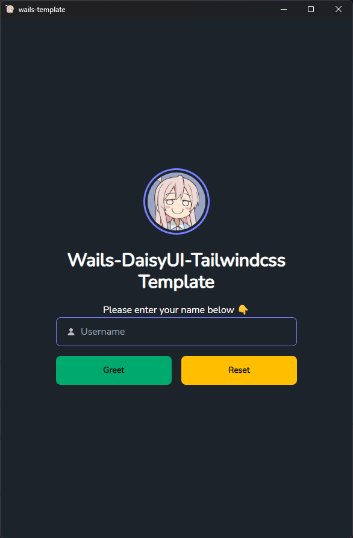

# WSTDT Template

Wails Svelte TS DaisyUI Tailwindcss Template

## About

This is a Wails Svelte-TS-DaisyUI-Tailwindcss template.



## Live Development

To run in live development mode, run `wails dev` in the project directory. This will run a Vite development
server that will provide very fast hot reload of your frontend changes. If you want to develop in a browser
and have access to your Go methods, there is also a dev server that runs on http://localhost:34115. Connect
to this in your browser, and you can call your Go code from devtools.

## Building

To build a redistributable, production mode package, use `wails build`.

You can also use the included `build.sh` script:

```bash
./build.sh dev                       # Dev mode (standard window)
./build.sh dev --transparent         # Dev mode (transparent frameless)
./build.sh dev --transparent --gtk3  # Dev mode (transparent, GTK3 backend)
./build.sh build                     # Production build (standard window)
./build.sh build --transparent       # Production build (transparent frameless)
./build.sh build --transparent --gtk3 # Production build (transparent, GTK3 backend)
```

## Transparent Mode

Transparent mode creates a frameless window with a transparent background, useful for overlay-style UIs.

### Platform Support

| Platform | Status | Notes |
|----------|--------|-------|
| macOS | Supported | Works out of the box |
| Windows | Supported | Requires Windows 11 for translucent backdrop |
| Linux (GTK3) | Supported | Requires a compositor; build with `--gtk3` flag |
| Linux (GTK4) | **Not supported** | Wails v3 alpha limitation — `setTransparent()` is a no-op stub |

### Linux Notes

Ubuntu 24.04+ defaults to the GTK4 backend, which does **not** support transparency in wails v3 alpha. To use transparent mode on Linux, build with the GTK3 backend:

```bash
./build.sh dev --transparent --gtk3
```

This requires `libgtk-3-dev` and `libwebkit2gtk-4.1-dev` to be installed.
